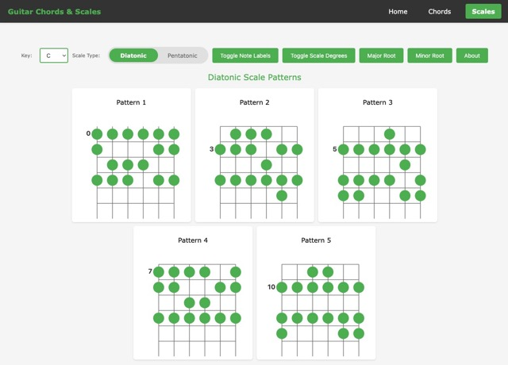

# Guitar Chords and Scales Reference



## Overview

This is a web-based guitar reference application that provides interactive chord diagrams and scale patterns to help guitarists learn and practice. The application is built with vanilla JavaScript and SVG graphics, offering a clean, ad-free experience for musicians.

## Features

### Chord Reference
- **Chord Diagrams**: Visual SVG representations of guitar chord shapes
- **Key Selection**: Choose from 7 major keys (C, D, E, F, G, A, B) and 7 minor keys (Am, Em, Dm, Gm, Cm, Fm, Bm)
- **Chord Progressions**: View chords organized by their functional role in a key:
  - Primary progression (I-IV-V for major, i-iv-V for minor)
  - Secondary chords (ii, iii, vi for major; III, VI, vii for minor)
- **Chord Types**: Includes major, minor, and 7th chords
- **Progression Examples**: Clickable progression patterns (e.g., I-IV-V, I-V-vi-IV, ii-V-I)
- **Interactive Highlighting**: Click on progression patterns to highlight relevant chords

### Scale Patterns
- **Scale Types**: Switch between Diatonic and Pentatonic scale patterns
- **Key Selection**: Choose from all 12 keys (C, C#, D, D#, E, F, F#, G, G#, A, A#, B)
- **Visual Patterns**: 5-position scale patterns across the fretboard
- **Note Labels**: Toggle visibility of note names on the fretboard
- **Scale Degrees**: Toggle visibility of scale degree numbers (1, 2, 3, etc.)
- **Root Highlighting**: Highlight major or minor root notes in the patterns
- **Fret Numbers**: Display starting fret position for each pattern

### User Interface
- **Responsive Design**: Works on desktop and mobile devices
- **Clean Navigation**: Simple navigation between Home, Chords, and Scales pages
- **About Modal**: Detailed instructions and study suggestions for scale patterns
- **Donation Modal**: Ad-free experience with optional donation support

## Technical Architecture

### Project Structure
```
├── index.html              # Home page
├── chord.html              # Chord reference page
├── scale-patterns.html     # Scale patterns page
├── README.md               # This file
├── .gitignore              # Git ignore configuration
├── charts.css              # Main stylesheet
├── images/
│   └── screenshot.jpeg     # Application screenshot
├── src/
│   ├── index.js            # Chord application entry point
│   ├── scale-index.js      # Scale application entry point
│   └── modules/
│       ├── chord/
│       │   ├── data.js         # Chord data and progressions
│       │   ├── rendering.js    # SVG chord diagram generation
│       │   └── utils.js        # Chord utility functions
│       ├── scale/
│       │   ├── data.js         # Scale pattern data
│       │   ├── rendering.js    # SVG scale diagram generation
│       │   └── utils.js        # Scale utility functions
│       └── ui/
│           ├── events.js       # Event handling and state management
│           └── renderer.js     # UI rendering functions
└── styles/
    ├── base.css            # Base styles
    ├── chord.css           # Chord-specific styles
    ├── scale.css           # Scale-specific styles
    ├── ui.css              # UI component styles
    └── responsive.css      # Responsive design styles
```

### Key Technologies
- **HTML5**: Semantic markup structure
- **CSS3**: Styling with responsive design
- **Vanilla JavaScript**: No frameworks or libraries required
- **SVG Graphics**: Scalable vector graphics for chord and scale diagrams
- **ES6 Modules**: Modern JavaScript module system

### Data Structure

#### Chord Data
- **Chord Shapes**: Standard guitar chord shapes using fretboard notation (e.g., "x32010")
- **Progressions**: Pre-defined chord progressions for each key, organized by function (I, IV, V, ii, iii, vi, etc.)
- **Chord Types**: Major, minor, diminished, and 7th chords

#### Scale Data
- **Pattern Format**: 6-string × 6-fret patterns using letter notation (A, B, C, D, E, F, G)
- **Pattern Positions**: 5 patterns covering the fretboard
- **Transposition**: Patterns are transposed to any key using interval calculations

### Core Functionality

#### Chord Rendering
1. Parse chord shape string (e.g., "x32010")
2. Detect bar chords and calculate starting fret
3. Generate SVG with:
   - 6 vertical strings
   - 5 horizontal frets
   - Nut (thicker line at top)
   - Muted strings (X)
   - Open strings (O)
   - Fretted notes (circles)
   - Bar chord rectangles

#### Scale Rendering
1. Convert pattern to selected root note
2. Calculate transposition interval
3. Generate SVG with:
   - 6 strings × 5 frets grid
   - Note circles with labels
   - Scale degree numbers
   - Fret position indicator
   - Root note highlighting

#### Event Handling
- **State Management**: Tracks current key, scale type, visibility settings
- **Dynamic Rendering**: Re-renders diagrams when settings change
- **Interactive Elements**: Click handlers for progression patterns, toggle buttons
- **Modal Management**: About and donation modal functionality

## Usage

### Running the Application
1. Open `index.html` in a web browser
2. Navigate to "Chords" or "Scales" from the home page
3. Use the dropdown selectors to choose keys
4. Interact with toggle buttons and progression patterns

### Chord Page
1. Select a key from the dropdown (major or minor)
2. View chords organized by progression function
3. Click on progression patterns (I-IV-V, etc.) to highlight relevant chords
4. Study the chord shapes and their functional relationships

### Scale Page
1. Select a key from the dropdown
2. Toggle between Diatonic and Pentatonic scale types
3. Use toggle buttons to show/hide:
   - Note labels
   - Scale degrees
   - Root note highlighting (major or minor)
4. Study the 5-position patterns across the fretboard
5. Use the "About" modal for study suggestions

## Design Philosophy

### Ad-Free Experience
- This website will never host ads
- Optional donation modal supports continued development
- Clean, distraction-free interface for focused practice

### Educational Focus
- Clear visual representation of musical concepts
- Progressive disclosure of information (notes vs. scale degrees)
- Contextual highlighting to show relationships
- Study suggestions for effective practice

### Accessibility
- Responsive design for all screen sizes
- Clear visual hierarchy
- Keyboard navigation support (ESC to close modals)
- High contrast colors for visibility

## Development

### Adding New Chords
1. Add chord shape to `src/modules/chord/data.js`
2. Update progression data if needed
3. Chords automatically appear in the UI

### Adding New Scale Patterns
1. Add pattern to `src/modules/scale/data.js`
2. Ensure pattern uses 6-character strings (one per string)
3. Use underscore (_) for empty positions
4. Use letters (A-G) for notes

### Customization
- Modify CSS variables in `styles/base.css` for color themes
- Adjust SVG parameters in rendering functions for different sizes
- Update progression examples in `src/modules/ui/renderer.js`

## Browser Compatibility

- Modern browsers with ES6 module support
- Chrome, Firefox, Safari, Edge (latest versions)
- Mobile browsers with touch support

## License

This project is built by jctech. Feel free to use and modify for personal learning purposes.

## Support

If you find this tool helpful, consider supporting its development through the donation modal. Your support helps keep this resource free and ad-free.